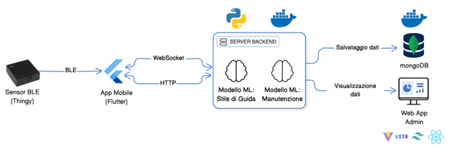

# wot-project-2024-2025-MobileApp-NestolaPagano

## Repository dei Componenti

- [Mobile App](https://github.com/UniSalento-IDALab-IoTCourse-2024-2025/wot-project-2024-2025-MobileApp-NestolaPagano)
- [Backend](https://github.com/UniSalento-IDALab-IoTCourse-2024-2025/wot-project-2024-2025-Backend-NestolaPagano)
- [Admin Dashboard](https://github.com/UniSalento-IDALab-IoTCourse-2024-2025/wot-project-AdminDashboard-NestolaPagano)
- [Presentazione](https://github.com/UniSalento-IDALab-IoTCourse-2024-2025/wot-project-presentation-NestolaPagano)

---

## Panoramica

DriveMood è una piattaforma end‑to‑end che integra un’app mobile, un backend FastAPI e una dashboard React per monitorare in modo continuo lo stile di guida e stimare in tempo reale l’urgenza di manutenzione dei veicoli.

L’app si connette tramite BLE al dispositivo Nordic Thingy:52, raccogliendo costantemente dati di accelerazione e rotazione. Queste informazioni vengono inviate al server ed elaborate tramite algoritmi di Machine Learning.

Durante la guida, l’app mostra un'emoticon che rappresenta in tempo reale l’andamento del comportamento al volante. Al termine della sessione, l’indice di manutenzione viene aggiornato e reso disponibile nella sezione dedicata.

Parallelamente, la web app consente all’amministratore di consultare statistiche aggregate sul comportamento di tutti gli utenti o di approfondire i dettagli di ciascun conducente.

---

## Architettura del Sistema

<p align="center">  
    
</p>

Le componenti principali dell’architettura sono:

- **Device BLE (Nordic Thingy:52)** funge da nodo di acquisizione sensoriale: grazie al suo accelerometro triassiale e al giroscopio interno, campiona i movimenti del veicolo a frequenza configurabile e li rende disponibili tramite caratteristiche GATT dedicate;
- **App Flutter/Dart** è la dashboard personale dell’utente: gestisce l’autenticazione via JWT, l’avvio e l’interruzione delle sessioni tramite chiamate HTTP protette e apre un canale WebSocket per l’invio periodico delle finestre di dati sensoriali dalla Nordic Thingy;
- **Server FastAPI**, containerizzato con Docker, rappresenta il cuore delle API REST e ospita un endpoint WebSocket che riceve lo stream sensoriale, lo classifica in tempo reale con un modello Random Forest restituendo le etichette di stile di guida e calcola l’indice di urgenza di manutenzione per sessione tramite un regressore Random Forest;
- **Database MongoDB**, in un container dedicato, conserva sia i singoli comportamenti etichettati sia i metadati delle sessioni, garantendo tracciabilità storica e aggregazione efficiente;
- **Dashboard React/Tailwind** è l'interfaccia amministrativa: offre una visione d’insieme della flotta e strumenti di ricerca per approfondire i dettagli di ciascun utente, con grafici interattivi che si aggiornano in tempo reale via chiamate REST.

---

## Come iniziare:

### Prerequisiti

- Assicurarsi di avere Flutter installato sul proprio computer.

### Procedura

1. Collegare lo smartphone al computer.


2. Recuperare l’elenco dei dispositivi collegati:
 ```
    flutter devices
 ```
Dalla lista, annotare l’ID dello smartphone da utilizzare.

3. Avviare l’app sul dispositivo selezionato:
 ```
    flutter run -d <ID_dispositivo>
 ```
Sostituire <ID_dispositivo> con l’ID recuperato al passo precedente.

---